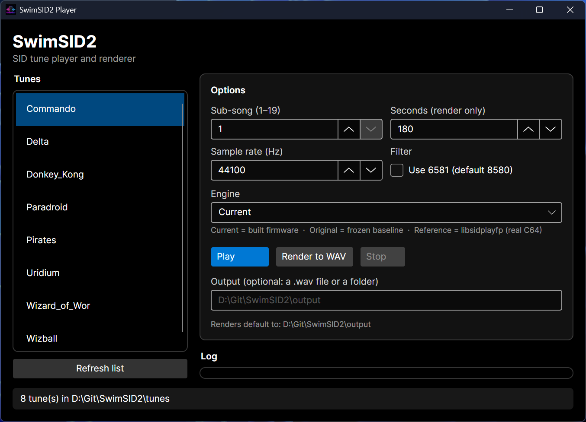
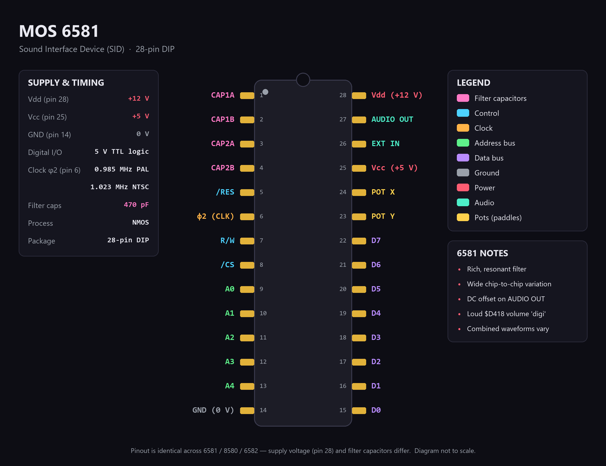
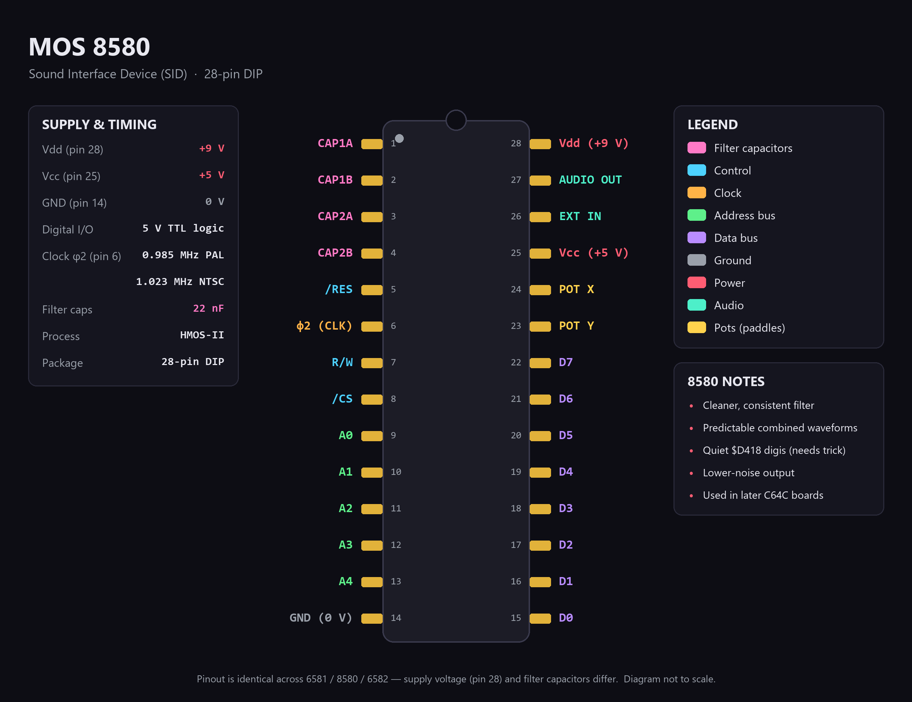

<p align="center">
  
</p>

<h1 align="center">
  SwimSID2
  <br>
  <sub>SwinSID Nano firmware continuation with a full PC emulation &amp; rendering toolchain</sub>
</h1>

<br>

**SwimSID2** is a [Team-Resurgent](https://github.com/Team-Resurgent) project (by
**EqUiNoX**) that continues development of the SwinSID Nano firmware and adds a
complete PC-based emulation/rendering toolchain, so the firmware can be tested
and improved entirely in software (no C64 or hardware programmer required).

## Credit / upstream

SwimSID2 builds directly on the excellent SwinSID firmware **source
reconstruction by Daniël Mantione (dmantione)**:

> https://github.com/dmantione/swinsid

All of the AVR firmware source in this repository derives from that
reconstruction. Huge thanks to dmantione for reverse-engineering and documenting
the firmware and making it buildable again. Please refer to the upstream
repository for the original work and history.

What SwimSID2 adds on top of the reconstruction:

- The firmware sources are focused on the "Lazy Jones fix" variant and tidied
  into a clean `src/` / `build/` layout.
- A [simavr](https://github.com/buserror/simavr)-based emulator engine (in
  [`sim/`](sim/)), built as a self-contained `swinsid.dll`, that runs the
  assembled firmware against real `.sid` tunes and renders the audio to a WAV
  file or streams it live through the speakers.
- A **reference player**: the same tunes played through
  [libsidplayfp](https://github.com/libsidplayfp/libsidplayfp) - a complete,
  cycle-accurate C64 (6510 + CIA + VIC timing, with the reSIDfp SID), the engine
  `sidplayfp` uses - so the firmware output can be compared against a "real
  machine" ground truth. This is what makes timing-sensitive tunes (e.g. Delta)
  play correctly for comparison.
- Three selectable engines for A/B testing: the **current** firmware (freshly
  built from `src/`), the **original** firmware baseline (a frozen, committed
  ELF), and the **reference** (libsidplayfp) - so you can hear exactly what a
  firmware change did and how it stacks up against a real C64.

## Background

The SwinSID was developed between 2005 and 2012 by Swinkels. In 2014 Codekiller
released the well known "Lazy Jones fix" firmware, which fixed the audio in the
game Lazy Jones.

Development of the SwinSID stalled and no source code was ever released, making
it difficult for the community to improve the firmware. Swinkels disappeared from
the scene and his
[SwinSID website](http://web.archive.org/web/20191212101114/http://www.swinkels.tvtom.pl/swinsid/)
is gone. dmantione reconstructed the firmware source so it can be assembled into
a byte-exact copy of the original, and SwimSID2 continues from there.

## How to build

This project is developed and built on **Windows using [MSYS2](https://www.msys2.org/)
(UCRT64)**. The firmware is assembled with `avr-gcc`/`avr-ld` and the emulator
engine is built with the UCRT64 GCC toolchain.

1. Install MSYS2 (e.g. `winget install MSYS2.MSYS2`), then open the **MSYS2
   UCRT64** shell (not the plain MSYS shell) and install the toolchain:

   ```bash
   pacman -Syu   # (run twice if it asks to close the terminal)
   pacman -S --needed git make diffutils \
       mingw-w64-ucrt-x86_64-gcc \
       mingw-w64-ucrt-x86_64-avr-binutils \
       mingw-w64-ucrt-x86_64-avr-gcc \
       mingw-w64-ucrt-x86_64-avr-libc \
       mingw-w64-ucrt-x86_64-libelf \
       mingw-w64-ucrt-x86_64-libsidplayfp
   ```

2. Clone with submodules (for the emulator's simavr dependency) and build the
   firmware from the repo root in the UCRT64 shell:

   ```bash
   git clone --recurse-submodules https://github.com/Team-Resurgent/SwimSID2.git
   cd SwimSID2
   make            # -> build/SwinSID88.elf + build/SwinSID88.hex
   ```

The result is `build/SwinSID88.hex` - the "Lazy Jones fix" firmware.
See [`sim/README.md`](sim/README.md) for the full emulator/engine build
(simavr submodule, `swinsid.dll`), and [`player/README.md`](player/README.md)
for the .NET player (which needs the .NET SDK).

## Emulate and improve

The [`sim/`](sim/) directory contains a PC emulator (built on
[simavr](https://github.com/buserror/simavr)) that runs this firmware against
real `.sid` tunes and renders the audio to a WAV file or plays it live. This
enables a fast edit -> assemble -> render -> compare loop for working on the
firmware. The same tune can also be rendered/played through the frozen
**original** firmware baseline or the
[libsidplayfp](https://github.com/libsidplayfp/libsidplayfp) reference player, to
compare your current firmware against the unmodified original and a real C64.
See [`sim/README.md`](sim/README.md).

## Player app (.NET)

<p align="center">
  
</p>

The [`player/`](player/) directory contains a .NET front-end that P/Invokes the
`swinsid.dll` engine. It lists the tunes in `tunes/` and can **render** them to
`output/<tune>.wav` or **play** the whole tune live (starting instantly,
stoppable at any time). Run it with arguments for a
[System.CommandLine](https://learn.microsoft.com/dotnet/standard/commandline/) CLI,
or with no arguments to open an [Avalonia](https://avaloniaui.net/) GUI:

```bash
cd player
dotnet build
swimsid list                          # list tunes
swimsid render Commando               # current firmware -> output/Commando.wav
swimsid play Wizball                  # play live
swimsid render Commando -e original   # original baseline -> output/Commando.orig.wav
swimsid render Commando -e reference  # libsidplayfp       -> output/Commando.ref.wav
swimsid                               # no args -> GUI
```

See [`player/README.md`](player/README.md) for details.

## Reference

*Click any image to view it full size.*

### SID chip pinouts

The SID is a 28-pin DIP; the pinout is identical across variants - only the
supply voltage (pin 28) and the filter capacitors differ. Full details are in
[`docs/sid-pinouts.md`](docs/sid-pinouts.md); vector sources live in
[`assets/`](assets).

<p align="center">
  <a href="docs/sid-6581-pinout.png"></a>
  <a href="docs/sid-8580-pinout.png"></a>
  <a href="docs/sid-6582-pinout.png"></a>
</p>

### SwinSID Nano schematic

The firmware targets the **SwinSID Nano** hardware (an ATmega88PA at 32 MHz in a
C64 SID socket). Annotated notes are in
[`docs/swinsid-nano.md`](docs/swinsid-nano.md).

<p align="center">
  <a href="docs/swinsid-nano-schematic.png"></a>
</p>

## Credits

- Original SwinSID hardware and firmware - **Swinkels**
- "Lazy Jones fix" firmware - **Codekiller**
- Firmware source reconstruction - **Daniël Mantione (dmantione)**,
  https://github.com/dmantione/swinsid
- libsidplayfp reference player (accurate C64 + reSIDfp) - **libsidplayfp /
  Simon White, Antti Lankila, Dag Lem, Leandro Nini**,
  https://github.com/libsidplayfp/libsidplayfp (GPL)
- SwimSID2 continuation and emulation tooling - **Team-Resurgent (EqUiNoX)**
