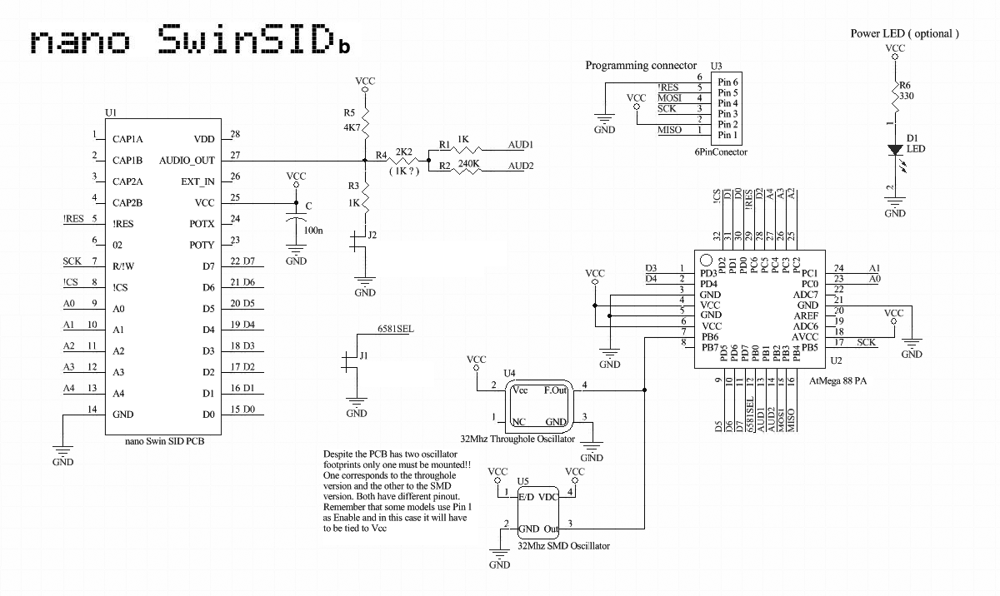

# SwinSID Nano schematic

The **SwinSID Nano** is a compact SwinSID board that drops into a C64's SID
socket. It is built around an **ATmega88PA** clocked at **32 MHz** (through-hole
or SMD oscillator) that emulates the SID and drives `AUDIO_OUT`. This is the MCU
the firmware in this repo targets, so the schematic is a handy hardware
reference when working on the firmware.

Key points visible in the schematic:

- **U2 - ATmega88PA** reads the C64 bus (`A0-A4`, `D0-D7`, `/CS`, `R/W`, `φ2`,
  `/RES`) exposed on the SID socket footprint (**U1**) and produces the analog
  output.
- **32 MHz oscillator** (U4 through-hole *or* U5 SMD - only one is fitted; note
  the two have different pinouts).
- **6-pin ISP** programming connector (U3: `MISO`, `MOSI`, `SCK`, `/RES`).
- **J1 (6581SEL)** selects the SID model behaviour; **J2** and the `AUD1/AUD2`
  resistor network set the audio output level.
- Optional power **LED** (D1) via R6.

> Source: schematic from the *nano SwinSID* project,
> <https://tolaemon.com/nss/> (image:
> <https://tolaemon.com/nss/imag/nss_schematic.png>). Included here for reference;
> all rights remain with the original author.
